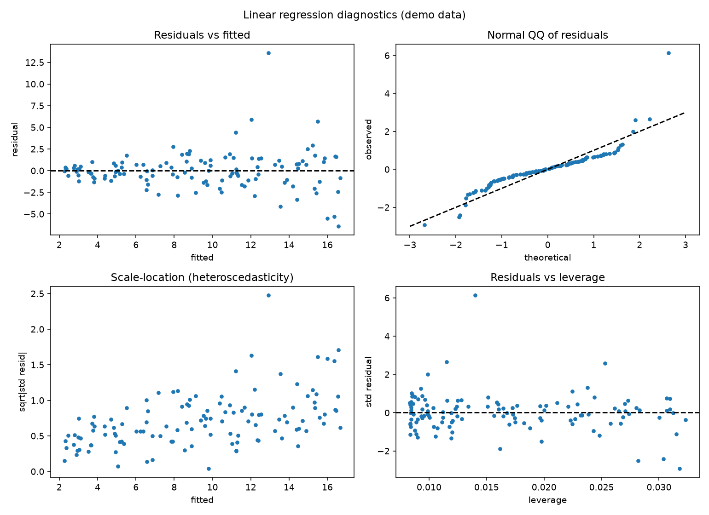

# Linear Regression Diagnostics

Fitting a line is one command. Knowing whether that line is a lie is the actual skill. Regression diagnostics are the four plots that tell you whether your model's assumptions hold — before you report a single coefficient.

## Why This Matters

Ordinary least squares assumes the errors are independent, have constant variance, and are roughly normal. Violate those quietly and your p-values and intervals become fiction. The diagnostic quartet catches the common failures at a glance: curvature (wrong model), a fanning spread (heteroscedasticity), heavy tails (non-normal errors), and a single high-leverage point dragging the whole fit.

## How It Works

1. Fit the model and compute residuals and leverage (the hat-matrix diagonal).
2. Plot residuals vs fitted, a normal QQ plot, scale-location, and residuals vs leverage.
3. Read each panel for its specific violation.

## What the Demo Shows



The demo fits data with deliberately non-constant variance and one outlier. The scale-location panel fans out (heteroscedasticity) and the leverage panel flags the outlier — exactly the problems you must address before trusting the fit.

## Run It

```bash
pip install -r requirements.txt
python demo.py
```

> Demonstrated on synthetic data, so it's fully reproducible with no external downloads.
